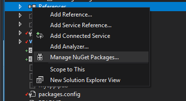

# ILMerge

[](https://www.nuget.org/packages/ILMerge/)

ILMerge is a utility that merges multiple .NET assemblies into a single assembly.
It is freely available for use and is available as a [NuGet package](https://www.nuget.org/packages/ilmerge).

If you have any problems using it, please get in touch. (mbarnett _at_ microsoft _dot_ com).
But first try reading [the documentation](ilmerge-manual.md).

ILMerge takes a set of input assemblies and merges them into one target assembly.
The first assembly in the list of input assemblies is the primary assembly.
When the primary assembly is an executable,
then the target assembly is created as an executable with the same entry point as the primary assembly.
Also, if the primary assembly has a strong name, and a .snk file is provided,
then the target assembly is re-signed with the specified key so that it also has a strong name.

ILMerge is packaged as a console application.
But all of its functionality is also available programmatically.

There are several options that control the behavior of ILMerge.
See the documentation that comes with the tool for details.

The current version is 2.14.1208 (created on 8 December 2014).
NOTE: There is no longer a version of ILMerge that runs in the v1.1 runtime.

ILMerge runs in the v4.0 .NET Runtime,
but it is also able to merge assemblies from other framework versions using the `/targetplatformoption`.
Please see the documentation.
(However, it can merge PDB files only for v2 (and later) assemblies.)

Currently, ILMerge works only on Windows-based platforms. It does not yet support Rotor or Mono.

If you use ASP.NET v2.0, then it provides a tool (based on ILMerge) to combine assemblies created during precompilation.
You can get more details from the [ASP.NET web site](http://msdn.microsoft.com/en-us/library/bb397866.aspx).

## Installation

As noted on the [ilmerge NuGet page](https://www.nuget.org/packages/ilmerge), the pacakge can be installed from the Visual Studio environment. Expand the project container in the `Solution Explorer` view. Right click on `references` and select `Manage NuGet Packages`



Ensure the `Package source` is set to `nuget.org`

Next, click on Tools - NuGet Package Manager - Package Manager Console. Ensure the `Package source` is also set to `nuget.org` 

To install for the project, use the Install-Package command:

```
Install-Package ilmerge -Version 3.0.21
```

## Usage

### MSBuild

ILMerge can be used in MSBuild using the NuGet package:

```xml
<Project Sdk="Microsoft.NET.Sdk">

  <ItemGroup>
    <PackageReference Include="ILMerge" Version="2.15.0" />
  </ItemGroup>

  <Target Name="ILMerge">
    <!-- the ILMergePath property points to the location of ILMerge.exe console application -->
    <Exec Command="$(ILMergeConsolePath) /out:Merged.dll File1.dll File2.dll" />
  </Target>

</Project>
```

Edit the project `.csproj` or `.vbproj` files (inside the respective `<Project> .. </Project>` tags, typically at the end of the file. If compiling for a specific target, use explicit directories such as `Bin\x64\Release`:


```
<ItemGroup>
    <PackageReference Include="ILMerge" Version="2.15.0" />
  </ItemGroup>

  <Target Name="ILMerge">
    <!-- the ILMergePath property points to the location of ILMerge.exe console application -->
    <Exec Command="$(ILMergeConsolePath) Bin\x64\Release\myapp.exe  /out:myapp.exe Bin\x64\Release\File1.dll Bin\x64\Release\File2.dll Bin\x64\Release\File3.dll " />
  </Target>
```
Although whitespace is usually ignored in XML files, in this case the exact text is processed as a DOS command, so to improve readability, use the carat `^` (shift 6) line extenders:

```
<ItemGroup>
    <PackageReference Include="ILMerge" Version="2.15.0" />
  </ItemGroup>

  <Target Name="ILMerge">
    <!-- the ILMergePath property points to the location of ILMerge.exe console application -->
    <Exec Command="$(ILMergeConsolePath) Bin\x64\Release\myapp.exe ^
    /out:myapp.exe ^
    Bin\x64\Release\File1.dll ^
    Bin\x64\Release\File2.dll ^ 
    Bin\x64\Release\File3.dll " />
  </Target>
```

The DOS dir /b option can be helpful in listing all of the dependencies:
```
dir bin\x64\Debug\*.dll /b
```

From Visual Studio Developer Command Prompt:
```ps1
# Download/install the package reference
msbuild /t:Restore

# Run the ILMerge target
msbuild /t:ILMerge
```

### To run `ILMerge` in a batch file:

The Visual Studio Developer Command Prompt is not needed here, as `msbuild` is not used.

```
@echo off

:: this script needs https://www.nuget.org/packages/ilmerge

:: set your target executable name (typically [projectname].exe)
SET APP_NAME=myapp.exe

:: Set build, used for directory. Typically Release or Debug
SET ILMERGE_BUILD=Debug

:: Set platform, typically x64
SET ILMERGE_PLATFORM=x64

:: set your NuGet ILMerge Version, this is the number from the package manager install, for example:
:: PM> Install-Package ilmerge -Version 3.0.21
:: to confirm it is installed for a given project, see the packages.config file
SET ILMERGE_VERSION=3.0.21

:: the full ILMerge should be found here:
SET ILMERGE_PATH=%USERPROFILE%\.nuget\packages\ilmerge\%ILMERGE_VERSION%\tools\net452
:: dir "%ILMERGE_PATH%"\ILMerge.exe

echo Merging %APP_NAME% ...

:: add project DLL's starting with replacing the FirstLib with this project's DLL
"%ILMERGE_PATH%"\ILMerge.exe Bin\x64\Release\%APP_NAME%  ^
  /lib:Bin\%ILMERGE_PLATFORM%\%ILMERGE_BUILD%\ ^
  /out:%APP_NAME% ^
  FirstLib.dll ^
  mylib1.dll ^
  Microsoft.lib2.dll ^
  SomeOtherLib.dll ^
  \otherlibdir\otherlib.dll 


:Done
dir %APP_NAME%
```


